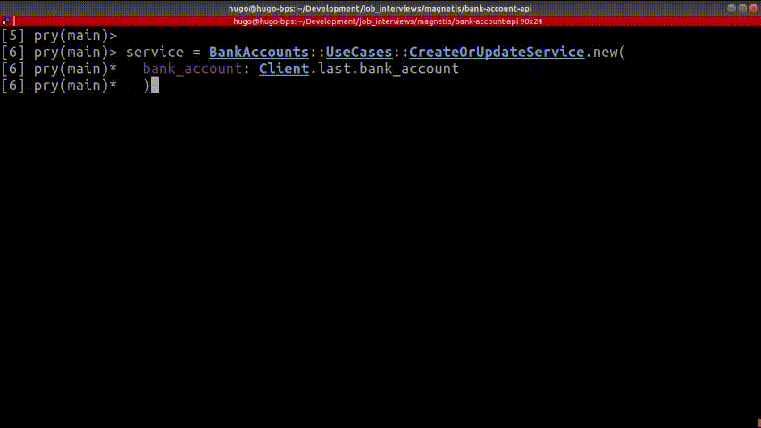
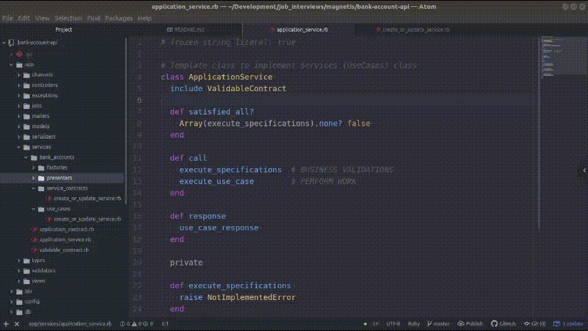

# README

Technical challenge to Engineering Backend position

### Requirements:
* Ruby version: `2.6.3`
* Rails version: `5.2.4.2`

* Database: `Postgres`

  - username: `postgres`
  - password: `postgres`

  - Obs.: This credentials can be changend in `config/database.yml`

### Configurations

1. Clone the repository
2. Run `bundle`
3. Run `rails db:create db:migrate db:seed`

### Automated testing
1. Run `rspec ./spec`

### API Documentation
1. Run `rails server`
2. Open `http://localhost:3000/api-docs/index.html`

### Usage
1. Run `rails server`
2. Read API Documentation

#### Summary usage flow
  * Open new bank account:

    1. Create new client account: `POST /clients`
    2. Log in with client account: `POST /auth/login`
    3. Open bank account: `POST /bank_account`

  * Update bank account data:
    1. Log in with client account: `POST /auth/login`
    2. Update bank account: `POST /bank_account`

  * Listing all guests:
    1. Log in with client account: `POST /auth/login`
    2. Listing yours guests: `GET /clients/my_indications`

### Technical explanation

#### Security
1. Rack Cors
2. Rack Attack
3. JWT
4. Symmetric Encryption
5. Rails Credentials

#### Database and Models
1. [Entity Relational diagram](erd.pdf)

  - Why use only Client Table instead of new Bank Account Table with has_one association?
    - Because is less code.
    - It results in fewer SQL statements.
    - It executes faster the SELECT queries.
    - It avoids.
    - If necessary that Client has many account, this association will be refactored

  - Create Model Bank Account Not-ActiveRecord
    - Because business layer responsibilities are better isolated.
    - Using ActiveModel::Model module to use some good resources of Rails, as validation.

#### Application Services
1. Proposal and purpose:
Services objects aim to minimize high coupling. Just extract important use cases from Rails models. You are more free to model your use cases according to the context.

2. Basic funcionality:

Every service must have 4 basic implementations: (based in a book: Confident Ruby - Avdi Grimm)
  - Collecting and validate input
  - Performing works
  - Delivering output
  - Handling failures

3. Details:

  - Collecting and validate input:
    - I implemented the module to be used as a mixin called Validable. This module will perform a class contract validation after the initialization of each service.

    - Class Contract Validation must be created with same name of the use case, but in `service_contracts` directory.

    - To implement Class Contract Validation, you must be use the gem DryValidation. It is a excelent gem to validate yours classes.

  - Performing works:
    - All services contains the `call` method. It a responsable to execute business validations and all logic of the use case.

    - Business Validation: read about [Specification Pattern](https://martinfowler.com/apsupp/spec.pdf)

    - Use Cases: read about [Use Case](https://martinfowler.com/bliki/UseCase.html)

    - It will be necessary implement 3 private methods:
      - #execute_specifications
      - #execute_use_case
      - #use_case_response

  - Delivering output
    - Implement `#use_case_response` private methods
    - Used to format response of the use case

  - Handling failures
    - Don't forget to handle exceptions

#### Others observations:
1. Exceptions
  - It was created a new directory to save all exceptions class
  - Using I18n to tranlate messages
  - Use `:around_action` in ApiController to handle with all exceptions of the API

2. Types
  - It was created a new directory to save all custom types.
  - Used in ActiveRecord API

3. Custom Validation
  - It was created a new directory to save all custom validations
  - Created CPFValidator and EmailValidator
